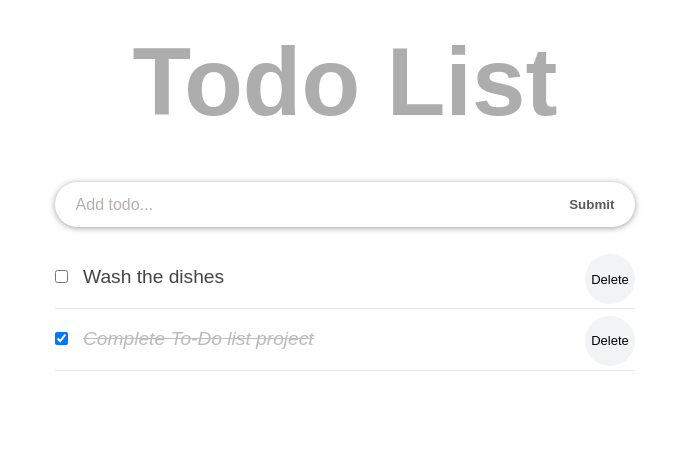

# To-Do list
"To-do list" is a tool that helps to organize your day. It simply lists the things that you need to do and allows you to mark them as complete.



## Built With

- Javascript
- HTML 5
- CSS 3
- React

## Usage
### Local installation
```console
$ git clone git@github.com:vicmaburrito/to-do_list_react.git
$ cd to-do_list_react
$ npm install
```

### To run the project
```console
$ npm start 
```

## Live Demo

[Live Demo Link](https://vicma-to-do-list-react.herokuapp.com/)

## Authors

👤 **Manuel Aldaraca**

- GitHub: [@vicmaburrito](https://github.com/vicmaburrito)
- LinkedIn: [Manuel Aldaraca](https://www.linkedin.com/in/manuel-aldaraca)

## 🤝 Contributing

Contributions, issues, and feature requests are welcome!

Feel free to check the [issues page](https://github.com/vicmaburrito/Math-magicians/issues/new).

## Show your support

Give a ⭐️ if you like this project!

## 📝 License

This project is [MIT](./LICENSE) licensed.
